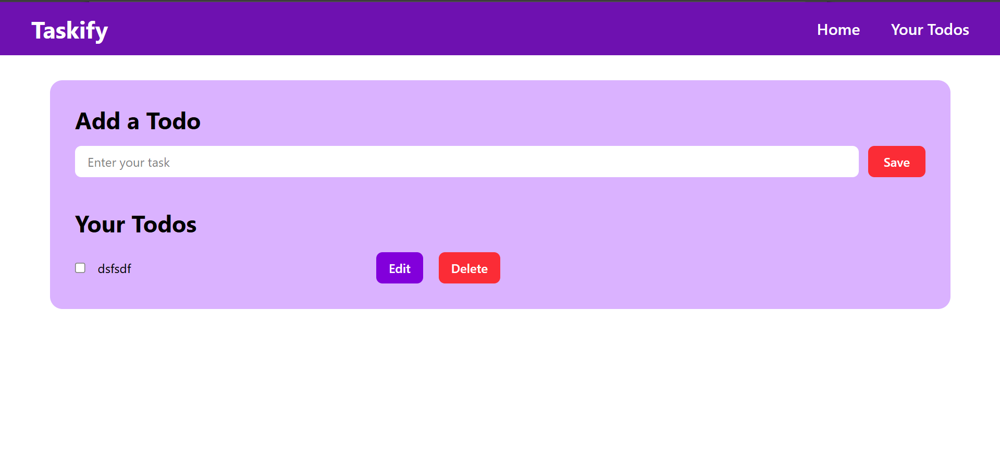

# ✅ Taskify - React Todo App

A clean and responsive Todo application built using React, designed to help users manage their daily tasks efficiently.

## 🚀 Features

* Add, edit, and delete tasks
* Mark tasks as completed
* Real-time UI updates
* Clean and user-friendly interface
* Persistent data using local storage

## 🛠️ Tech Stack

* React.js
* JavaScript (ES6+)
* HTML
* CSS

## 📚 What I Learned

* React fundamentals (components, state, props)
* Handling events and dynamic rendering
* Managing application state
* Working with localStorage for data persistence
* Improving UI/UX design

## 🎯 Future Improvements

* Add filter (completed / pending tasks)
* Add due dates and reminders
* Improve animations and transitions
* Dark mode support

## 📸 Preview

## 🌐 Live Demo

https://react-todo-dikshant.netlify.app/